# K-means for Clustering
Hausman, Sheline, Tober  
August 2, 2016  


<script type="text/javascript" async
  src="https://cdn.mathjax.org/mathjax/latest/MathJax.js?config=TeX-MML-AM_CHTML">
</script>

---

### Summary / Highlights
- K-means is a form of partitional or flat clustering (vs. hierarchical)
- K, or number of clusters, is specified up front (in R: set by 'centers' in 'kmean' parameters)
- To calculate: select initial cluster means or centers, then iterate through recalculating cluster means to minimize the distance from each point in each cluster to the respective cluster mean, until cluster means no longer change materially each round
- Run through multiple iterations of this calculation exercise, reselecting initial centroids each time, to minimize SSE by finding optimal centers (in R: set by ‘nstarts’ parameter in 'kmean')
- Favorable computational complexity - K-means scales linearly, so it is suitable for big data applications
- Example completed in R: [protein.R](https://github.com/jgscott/STA380/blob/master/R/protein.R) using  [protein.csv](https://github.com/jgscott/STA380/blob/master/data/protein.csv) 

***

### K-means example: protein
Uses [protein.R](https://github.com/jgscott/STA380/blob/master/R/protein.R) and [protein.csv](https://github.com/jgscott/STA380/blob/master/data/protein.csv) from [jgscott STA380 GitHub](https://github.com/jgscott/STA380).

***Setup***  
Read in data and view:

```r
# Old-school european protein consumption,
# in grams/person-day from various sources
protein <- read.csv("protein.csv", row.names=1)
head(protein, 10)
```

```
##                RedMeat WhiteMeat Eggs Milk Fish Cereals Starch Nuts Fr.Veg
## Albania           10.1       1.4  0.5  8.9  0.2    42.3    0.6  5.5    1.7
## Austria            8.9      14.0  4.3 19.9  2.1    28.0    3.6  1.3    4.3
## Belgium           13.5       9.3  4.1 17.5  4.5    26.6    5.7  2.1    4.0
## Bulgaria           7.8       6.0  1.6  8.3  1.2    56.7    1.1  3.7    4.2
## Czechoslovakia     9.7      11.4  2.8 12.5  2.0    34.3    5.0  1.1    4.0
## Denmark           10.6      10.8  3.7 25.0  9.9    21.9    4.8  0.7    2.4
## E Germany          8.4      11.6  3.7 11.1  5.4    24.6    6.5  0.8    3.6
## Finland            9.5       4.9  2.7 33.7  5.8    26.3    5.1  1.0    1.4
## France            18.0       9.9  3.3 19.5  5.7    28.1    4.8  2.4    6.5
## Greece            10.2       3.0  2.8 17.6  5.9    41.7    2.2  7.8    6.5
```

***Scaling***  
There are two different ways to scale - 'center' and 'scale'.  Applying both will result in a dataframe with mean of 0 and standard deviation of 1. It also 'standardizes' the scale of x and y to spread out data more evenly if it is tighter on the y axis than on the x axis.  Centering and scaling the data gives each variable equal contribution to distances in clusters. This makes the data more interpretable and is considered to be best practice when clustering.  
  
Scaling the protein data:

```r
# Center/scale the data
protein_scaled <- scale(protein, center=TRUE, scale=TRUE) 
```

***K-means in R (3 centers / clusters)***  
Variable 'K' is the number of means / clusters - answers the question, 'How many clusters do you want?'.  Given K-means is partitional / flat clustering, it takes in the number clusters as an input parameter (via number of 'centers').

```r
## first, consider just Red and White meat clusters
cluster_redwhite <- kmeans(protein_scaled[,c("WhiteMeat","RedMeat")], centers=3)
```

***Plot (3 centers / clusters)***  
Plot points of individual countries with labels:

```r
# Plot with labels
# type = 'n' just sets up the axes
plot(protein_scaled[,"RedMeat"], protein_scaled[,"WhiteMeat"], xlim=c(-2,2.75), 
    type="n", xlab="Red Meat", ylab="White Meat")  
text(protein_scaled[,"RedMeat"], protein_scaled[,"WhiteMeat"], labels=rownames(protein), 
    col=rainbow(3)[cluster_redwhite$cluster])
```

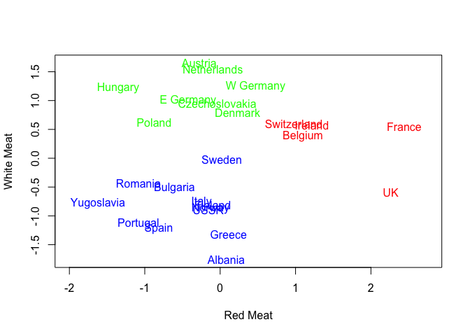<!-- -->


***K-means in R (7 centers / clusters, add iterations with 'nstart')***  
Repeat exercise with 7 clusters instead of 3.  'nstart' is the number of 'random restarts' for this algorithm: this runs K-means 50 times and picks the best one as an output.  

```r
## same plot, but now with clustering on all protein groups
## change the number of centers to see what happens.
cluster_all <- kmeans(protein_scaled, centers=7, nstart=50)
```

***Interpreting K-means outputs***  
Output 'cluster_all' is a list of objects:  

```r
names(cluster_all)
```

```
## [1] "cluster"      "centers"      "totss"        "withinss"    
## [5] "tot.withinss" "betweenss"    "size"         "iter"        
## [9] "ifault"
```

Use '$center' to see means by variable for each cluster:  

```r
# 7 cluster centers, each of which lives in a 9D euclidean space (9D given 9 X variables)
cluster_all$centers
```

```
##        RedMeat  WhiteMeat        Eggs       Milk       Fish    Cereals
## 1  1.599006499  0.2988565  0.93413079  0.6091128 -0.1422470 -0.5948180
## 2 -0.949484801 -1.1764767 -0.74802044 -1.4583242  1.8562639 -0.3779572
## 3  0.006572897 -0.2290150  0.19147892  1.3458748  1.1582546 -0.8722721
## 4 -0.083057512  1.3613671  0.88491892  0.1671964 -0.2745013 -0.8062116
## 5 -0.068119111 -1.0411250 -0.07694947 -0.2057585  0.1075669  0.6380079
## 6 -0.807569986 -0.8719354 -1.55330561 -1.0783324 -1.0386379  1.7200335
## 7 -0.605901566  0.4748136 -0.27827076 -0.3640885 -0.6492221  0.5719474
##       Starch        Nuts     Fr.Veg
## 1  0.3451473 -0.34849486  0.1020010
## 2  0.9326321  1.12203258  1.8925628
## 3  0.1676780 -0.95533923 -1.1148048
## 4  0.3665660 -0.86720831 -0.1585451
## 5 -1.3010340  1.49973655  1.3659270
## 6 -1.4234267  0.99613126 -0.6436044
## 7  0.6419495 -0.04884971  0.1602082
```

***Insights from K-means outputs***  
Countries that fell in a cluster together might have the following characteristics:  

- Slightly above average RedMeat, WhiteMeat, Eggs, Milk, Fish  
- Below average consumption of Cereals, Nuts  
- Average for Starch, Fruits, Vegetables  

Which cluster do Scandinavian countries fall in?  

- The cluster with a higher Fish mean value

Use ‘$cluster’ to see which cluster each country is in:


```r
# Clustering identities
cluster_all$cluster
```

```
##        Albania        Austria        Belgium       Bulgaria Czechoslovakia 
##              6              4              1              6              7 
##        Denmark      E Germany        Finland         France         Greece 
##              3              4              3              1              5 
##        Hungary        Ireland          Italy    Netherlands         Norway 
##              7              1              5              4              3 
##         Poland       Portugal        Romania          Spain         Sweden 
##              7              2              6              2              3 
##    Switzerland             UK           USSR      W Germany     Yugoslavia 
##              1              1              7              4              6
```

***Plot (7 centers / clusters)***  
Plot output from running K-means. Since there are 9 different variables in this dataset, the resulting plot would be 9-D, so there’s no way to plot all variables and see exact clusters.  
(NOTE: can only plot on 2D, RedMeat and WhiteMeat could be interchanged, can look at clusters within plot based on any two sets of variables)


```r
plot(protein_scaled[,"RedMeat"], protein_scaled[,"WhiteMeat"], xlim=c(-2,2.75), 
    type="n", xlab="Red Meat", ylab="White Meat")
text(protein_scaled[,"RedMeat"], protein_scaled[,"WhiteMeat"], labels=rownames(protein), 
    col=rainbow(7)[cluster_all$cluster]) ## col is all that differs from first plot
```

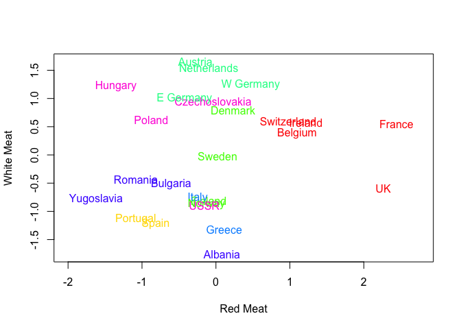<!-- -->


### K-means notes  
K-means is a type of _partitional clustering_.  

- K is specified up front (K = number of clusters)  
- Each point is assigned to a cluster  
- Each cluster is associated with a center (μ~k~)   

Select K points as initial centers.  Repeat the following steps until 'nothing changes':  

- Form K clusters by assigning each data point to its nearest center (matter of calculating all of the distances from all of the points to each center)
- Recompute the center of each cluster (mean)

How is this done?

- R chooses centers randomly by taking a random sample without replacement of ‘K’ data points 
- R assigns these as cluster centers
- There are packages for R that deal with how to select an appropriate K and ideal starting points for cluster centers (see k-means ++)
- Parameter ‘nstarts’ instructs how many times to re-initiate the selection of initial centers in order to run multiple iterations, generating different clusters and associated cluster means, to find the optimal centers

How do we measure 'nearest' to find nearest center?  

- Nearest is measured by the distance function specified in the K-means parameter (e.g., Euclidean / as the crow flies vs. $\ell$^1^ / Manhattan / taxicab / citygrid)

What do we mean by repeat until 'nothing changes'?  

- Repeat until nothing changes by very much (e.g., centers change by less 10^-6^)

### Computational complexity  
While computational complexity varies for different algorithms, it's very favorable for K-means - which is at the heart of why K-means is so widely used.  K-means computational complexity:
$$O(n⋅k⋅I⋅d)$$ 

$where: \\ \quad n = \#  \,of\,observations\\ \quad k = \#\,of\,centers \\ \quad I = \#\,of\,max\,iterations\\ \quad d = \#\,of\,features$


K-means scales linearly (e.g., if you double any of these, you will double computing time), so it is suitable for big data applications. 


### Measuring the quality of a clustering  
For each point x~i~, 'error' is the distance from its centroid: 
$$d(x_i,\,\mu_i), \,where\,a_i\,\,is\,the\,cluster\,id\, for\,x_i$$
    
Typical measure is the SSE (sum of squared errors):  
$$SSE = \sum_{j=1}^{K_1} \sum_{i:a_i=j} d(x_i, \mu_j)^2$$

Assumption is that SSE is as small as possible.  Optimal clustering has lower SSE; sub-optimal clustering has higher SSE.  

The [K-means example file](https://github.com/jgscott/STA380/blob/master/notes/kmeans_examples.pdf) on Scott's GitHub walks through some examples, including one example with different SSEs for same dataset and number of clusters due to different centers:  
</br>
<div style="border:1px solid lightgray;"> 
  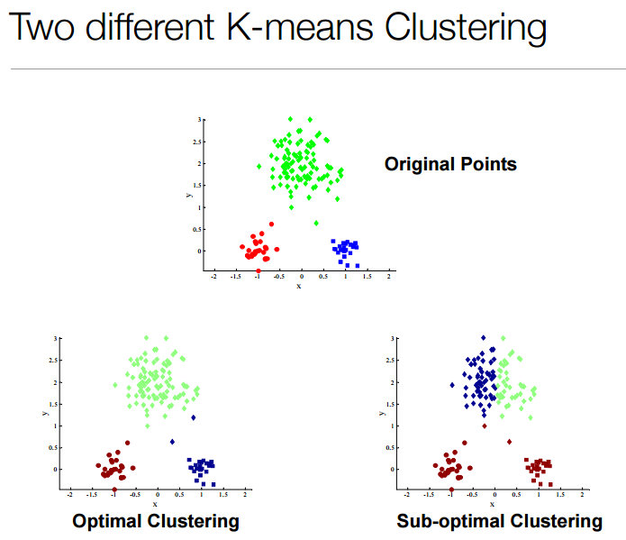
</div>
</br>

### Choosing initial centroids  
Choosing initial centroids is important-- where you start matters!  
More data points and more dimensions means hundreds of thousands of restarts would be needed to get the optimal clustering… probability is not on your side.  

***Example of successful initial centroids***   
Doesn't look good initially, but result is optimal.   
</br>
<div style="border:1px solid lightgray;">  
  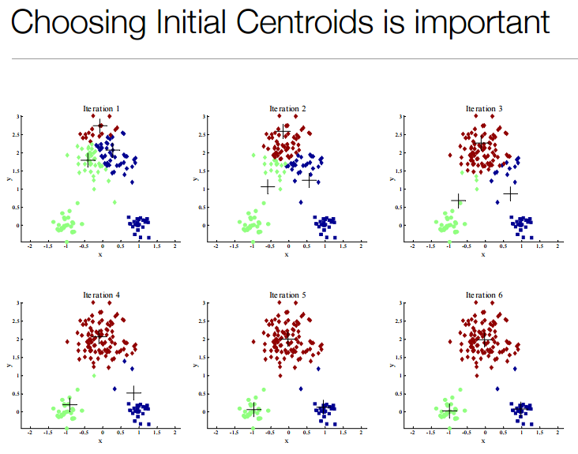
</div>
</br>

***Example of unsuccessful initial centroids***  
Looks good initially, but result is not optimal.  
</br>
<div style="border:1px solid lightgray;">
  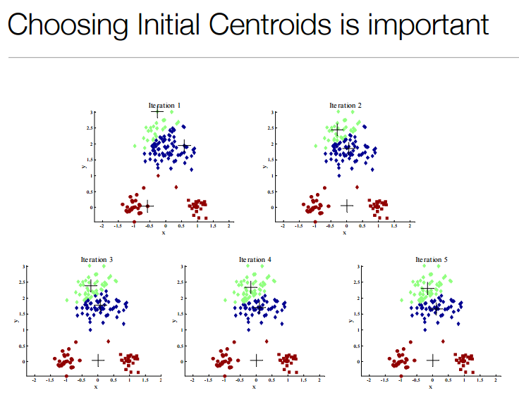
</div>
</br>

***Impact of initial centroid selection with higher K***  
Example I vs II: 10 clusters   
Can see the difference based on if a cluster has multiple centroids in initial selection.  
</br>
<div style="border:1px solid lightgray;">
  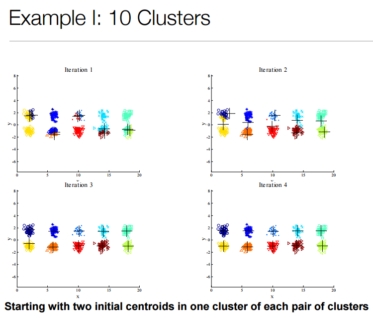  
</div>
</br>
<div style="border:1px solid lightgray;">
  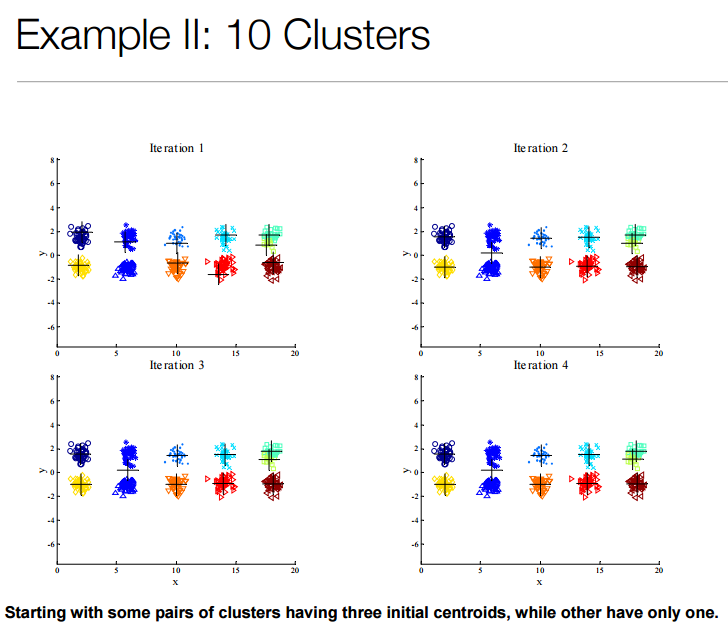  
</div>
</br>

This is a reason to use multiple restarts (‘nstart’), but you don't need to increase this to the point where you are running exponentially high restarts.  

### Limitations of K-means  
***K-means story***  
Mr. & Mrs. Scott driving around Flanders, Belgium (where much of WW1 happened).  Walking through Ypres, which had speakers all around town playing music.  JT Bringing Sexy Back interrupts elevator music because Spotify used K-means to cluster music.  K-means fail...  

***Differing sizes***  
If sizes of clusters are different, it doesn't do very well:  
</br>
<div style="border:1px solid lightgray;">
  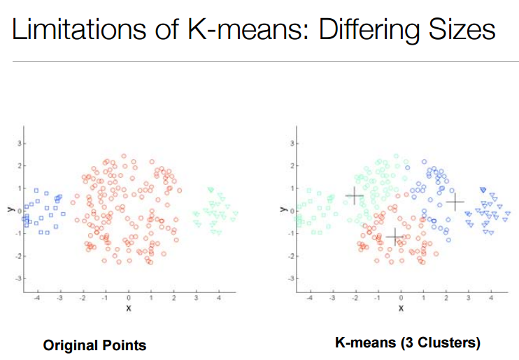
</div>
</br>

***Differing density***  
If density varies across points, it doesn't do well:  
</br>
<div style="border:1px solid lightgray;">
  
</div>
</br>

***Non-globular shapes***  
Similar to two circles, K-means doesn't register shapes:  
</br>
<div style="border:1px solid lightgray;">
  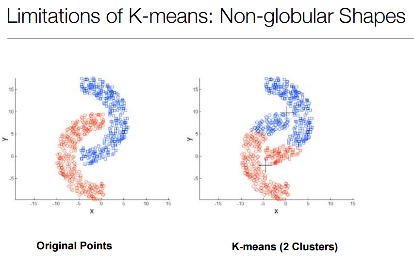
</div>
</br>

### Overcoming K-means limitations?
***Increase cluster size***  
This can help:  
</br>
<div style="border:1px solid lightgray;">
  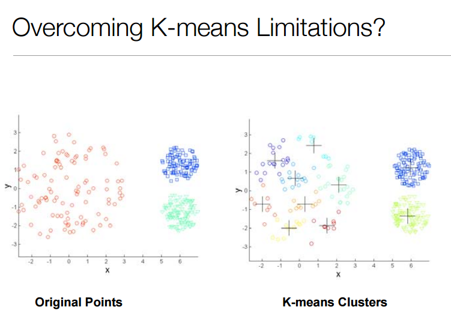
</div>
</br>

Or not:  
</br>
<div style="border:1px solid lightgray;">
  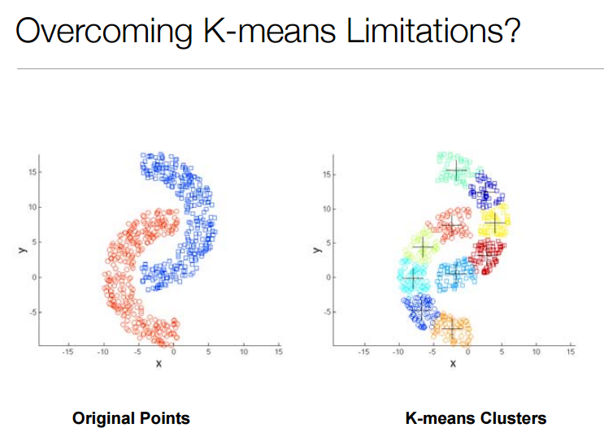
</div>
</br>

Can also try doing a hierarchical cluster of clusters (covered in a future class).  

### K-means++

- K-means++ improves selection of initial centroids, ultimately leading to an improved K-means model
- Readings posted to Scott's GitHub for additional reference: an [original paper](http://ilpubs.stanford.edu:8090/778/1/2006-13.pdf) and a [Wiki article](https://en.wikipedia.org/wiki/K-means%2B%2B)
- R package that supports K-means++: [LICORS](https://cran.r-project.org/web/packages/LICORS/index.html), using _kmeanspp_ - see [page 19 of the LICORS reference manual](https://cran.r-project.org/web/packages/LICORS/LICORS.pdf#page=19) for more information on kmeanspp

</br>
